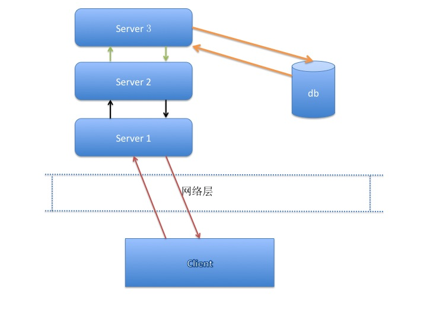

# 系统测试: 数据流测试

	author: silencelikesky@sina.com
	明心见性，可以为神

#### At first,I don't want picture 其实一开始我是不想画图的
数据流，就是数据在系统中走过的路径。表现为程序内部的数据流向 和 程序模块间的数据流向

举个例子，一个常见的C/S环境下的数据流交互示意图：

在上面的图形中，那些箭头的组合就是数据流。

#### neither boy not girl, so this is Pusa 非男非女菩萨相，皆是众生相
通过上面的图，可以拆分出以下这些数据流：

1. client -> server1 -> client
* server1 -> server2 -> server1
* server2 -> server3 -> server2
* server3 -> db -> server3
* server1 -> server2 -> server3
* server1 -> server2 -> server3 -> db
* client -> server1 -> server2 -> server3 -> db
* server1 -> server2 -> server3 -> db -> server2 -> server1
* client -> server1 -> server2 -> server3 -> db -> server2 -> server1 -> client

其中，1，2，3，4，5 都是属于程序模块内部的 数据流，也就是我们平时所说的***接口测试*** ；6，7，8，9 是程序模块间的数据流，这个是通常我们所说的***数据流测试***

数据流根据是否实时，又可以分为实时数据流和离线数据流：

* 实时数据流多用在请求检索和实时事物；比如登录注册，购买退款
	* 实时数据流通常都是通过thrift，http，socket等响应式请求进行交互
* 离线数据流多用在数据统计或者结果分析；比如昨日登录用户的分布数据，用户的喜好分析
	* 非实时数据流多通过log文件，db table，hadoop等方式存储，之后再进行请求分析

然而，他们其实都是数据流测试中的一部分。

#### Without chopsticks, how can I eat meat；分手了，锅都带走了
然而，说了这些，其实没啥卵用。
那么，数据流该如何测试呢？

数据流测试，分为两部分，数据验证和数据监控。(说的好像其他地方不是是的)

* 数据验证，就是验证发出去和接收到的数据是否正确，包括：
	* 数据是否按照需求正确的发送出来了
	* 请求地址是否正确
	* 参数是否完整，参数内容是否正确
	* 参数变量的值是否正确
	* 数据格式是否符合预期
* 数据监控，就是在该功能上线后，去验证线上的数据是否正确，包括：
	* 数据是否存在丢失
	* 实时数据是否存在严重的延迟
	* 非实时文件数据记录是否完整
	
一个很惨淡的现状: **我们绝大部分的测试其实都是在做数据验证的工作，**即只能保证当时出去的东西是对的。至于线上是不是对的，其实是没办法的。在大部分地方，线上的问题都是依靠用户反馈，运维，其他同事瞅见了才汇报过来的，而测试，就是在别人反馈过来后参与背锅的。

恩，扯远了。回头来看看数据流测试该如何做吧。

数据流测试，根据之前的测试关注点，可以知道，通过以下几个方面来进行：

* client抓包
	* 主要是用于客户端 与 服务端交互时
	* 工具有：fiddler，浏览器开发者工具，wireshare等
* nginx，程序模块的日志
	* 用于后台程序模块间的测试
	* 工具命令有：vim，grep，tail，less，head等
* 测试代码桩，单元测试
	* 用于程序内部数据流和程序逻辑的一些校验，及一些常规调用走不到的地方
	* 工具有：vim，eclipse，xcode等等。
	* tips：代码插桩时，应避免在公共代码上插桩，以免影响别人使用
* 模拟请求
	* 发送一条数据，然后检测该数据在经过数据流模块后是否缺失；或者拒绝响应
	* 用于实时流
	* php，httplib, httblib2
	
非实时流的测试，这里就不说了，因为通常都是统计需求，并且跟业务强相关

#### For the kingdom; 好好读书，一切为了部落
总的说起来，测试最难的是思维周密；其次是不得下手，再次是数据不充分。
这里就先找最简单的数据方法做一个简单介绍。

##### 服务端

测试数据的准备，跟业务场景有很大关系；我们以用户登录系统购买商品为例进行测试。

* 业务场景：***服务端***对用户登录逻辑做了一些修改限制，不涉及接口的修改；并且修改了用户购买逻辑，接口不变
* 测试分析：本次修改涉及登录，购买两个接口内部修改，正常用户客户端无感；测试的重点主要在***服务端***。
	* 线下通过修改数据库中 用户的注册时间，属性，和 登录频率 来验证登录接口
	* 线下修改用户余额等信息 测试 购买流程
	* 问题点：
		* 线下可以通过修改数据库信息等方式来测试该修改；但是线上数据不能直接修改，how can we do？

解决方案1：

* 从线上的数据库 select 一批符合条件的用户；用这些用户来验证登录
* 线上购买常规性检验，然后检测线上的购买数据

主要通过接口测试的方式来进行测试，最后通过客户端看一下是不是显示正常就好了。

##### 客户端

还是那个例子，还是熟悉的配方

* 业务场景：***客户端***对用户登录逻辑做了一些修改限制，不涉及接口的修改；并且修改了用户购买逻辑，接口不变
* 测试分析：本次修改涉及登录，购买两个接口内部修改，正常用户客户端无感；测试的重点主要在***客户端***。
	* 链接不同的wifi网络，切换ip进行测试(如果客户端有ip切换的需求，然而基本上不会有)
	* 修改手机本地时间
	* 杀进程
	* 通过抓包工具 fiddler，charles，wireshare等限制网速
	* 通过抓包工具 fiddler，charles，wireshare等自定义返回值，验证客户端对各种返回值的处理
