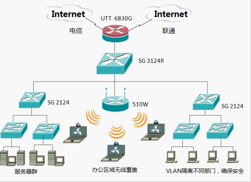
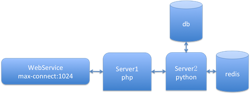

# 系统测试之压力测试

#### 一个和尚有水吃，三个和尚没水吃

说压力测试之前，先来一个图，了解一下网络的拓扑布局，如下：

> **我们是如何访问一个网站的？**
> 
1. 在自己电脑上输入链接；该链接发送给局域网路由，由局域网路进行解析
2. 局域网路由经过链路，最后转发给网站主机
3. 网站主机处理数据后，经过路由再传送给客户端

在上面这个过程中，简单说，访问一个网站经过这几个步骤：

* 客户端——网络——服务端——网络——客户端

so，As a tester，那么问题来了：**上面这个过程：总共有几个测试点？**

> **一个网站的访问速度受哪些资源影响？**
>
* `带宽限制`
* `网络耗时` (路由器的寻址时间 + 传输损耗)
* `服务器的响应速度`
* `客户端的渲染速度` 渲染速度: mem,ram,显存，固件驱动环境

BTW，上面这些其实是我瞎蒙的。那么问题来了: **哪一些才是限制最大的呢？**

#### 你们学校门口的门卫大爷叫什么名字

说完网络，回过头来继续说压力测试。

首先，***什么是压力呢？***

* 不扯淡又通俗的说：**所谓压力，就是一个主体同时做多个事物时的承受能力。**
	* 举个例子：你的好哥们A和好基友B同一天结婚，都要求你必须得到场，这时候你就会很蛋疼，一个你怎样才能两边都照顾到呢？这时候你面临的就是最简单的`资源压力`
	* 再举个例子：奥特曼充满电放个必杀技，需要1h；然而30min后大怪兽就要来毁灭地球了，奥特曼必须在30min内充满电，How？这个就是`速率压力`
	* 还举个例子：你是一个土财主，要去给灾民送粥提现爱心；你只有一个勺子，但是呼啦啦围上来了十个人，都要你第一时间给粥。你要咋办？这个就是`线程压力`
* 装逼点的说：**所谓压力，就是有限资源被多个终端索求时候的状态值**
	* 就跟韦小宝晚上跟7个老婆玩耍一样，那就是最直观的压力。你懂得~

那么，***什么地方会出现压力瓶颈呢？***

根据`木桶原理`来说，一个系统的性能最差的地方，就是这个系统的压力瓶颈指标。比如：WebService最多只能支持1024个连接，而现在的持续连接数在2000以上，那么不管怎么看，WebService都是一个瓶颈。

OK，上面说了压力测试。然并卵，我们的问题还是没解决。那，再回来说说压力测试的事情。

**压力测试 就是 测试目标系统的 各种压力指标**

那么，如何判断什么情况下，需要哪些压力指标呢？

一个完善的系统，粗分都可以分为S/C[这里B也是当做C来看的]。C的测试默认是不包含在压力测试里面的，因为那是另一个物种。

对于S来说，需要测试的指标可以分为两种：

* 系统资源
	* 带宽
	* mem,cpu
		* 系统级
		* 业务进程占比
		* 数据库
* 业务数据
	* 数据响应时间
	* 每秒处理数
	* 数据吞吐量
	* 事物响应数

#### 当羚羊跑不过捕食的狮子时，要怎么办？只要跑得过队伍里其他羚羊就可以了
对于一个系统，如何进行压力测试呢？
为了方便于说明，先来个简单系统业务示意图，如下：

先看下这个系统的特点：

* WebService 的最大连接数为1024
* Server1主要是做参数校验和业务数据整合
* Server2是数据的存储接收者
	* Server2 需要连接 数据库
	* Server2 需要连接Redis

So，根据以上特点可以得出以下几个测试方案：

* 静态单页面/静态资源压力测试：
	* 静态资源的获取，没有持续连接；所以内存，cpu等通常不会是瓶颈
	* 因为静态资源基本不会涉及数据库和redis存储，所以，可能的瓶颈也就只是WebService和网络带宽
	* WebService 方面：可以从并发20一直到1024，然后继续到2000。
		* 如果资源很小，比如只是一个几十k的图片或者网页，出现同一连接数达到1024的概率还是很低的
		* 如果资源比较大，比如几十M甚至更大，则Webservice就可能出现连接池被占满
	* 带宽方面：这个做一个计算就基本可以得出来了。
		* 带宽计算：当前带宽是30M，静态资源是30k大小；则最小额定连接数为30M/30k=1024。然而，还需要计算平时其他连接程序的带宽占比，再进行相减。我这160的智商也说不清楚了
	* 测试方案：静态持续加压：并发100，200，300，...，2000；检测吞吐量，相应速度，失败占比
		* 如果从加压到200开始，网络吞吐量就一直没有变化。那说明当前的带宽太低
		* 如果加压到800开始，出现逐步上升的连接失败。那说明WebService连接数超限
		* So，**如果加压到200开始，出现逐步上升的连接失败，且网络带宽也一直没有变化；那么到底是哪里出了问题了呢？**
		* And，**如果业务需求真的有2000+以上的访问，该如何处理呢？**

 * 业务接口/非资源型的压力测试：
 	* 因为不涉及资源，所以往返数据体积较小，相应速度较快。通常带宽不会是瓶颈
 	* 要操作db和Redis，还要打log等，所以还需要关注内存和cpu
 	* Redis是基于内存的存储方案；如果机器挂了，内存里的数据就都丢光了，So，这就是为什么要关注内存的原因
 	* db的改写操作是最好cpu和mem资源的，表越大数据越复杂，就越耗；读操作其次。而且，数据库的连接池也是有固定数量的，So，你懂得~
 	* 测试方案：动态加压，并发100，200，300，...，2000；监测吞吐量，响应速度，失败占比，服务端内存，服务端Cpu，业务响应耗时，db读写速度，db是否死锁丢数据等
 		* 如果加压过程中，服务端响应速度逐步变慢，cpu，mem维稳，db操作耗时不变；则可能出现问题的地方有：服务端模块代码业务有问题，WebService连接数太小，`网络延迟`
 		* 如果加压过程中，服务端log中最多每秒只有300个记录，则可能情况：WebService连接数满了，服务端存取达到瓶颈
 		* 如果db挂了，Redis挂了~，那问题很直观就可以找到了，不扯这个淡了
 		* So，**如果Server1的响应时间是1s，Server2的响应时间是700ms，db查询耗时最低是500ms；那么问题出现在哪里呢？**
* 多业务组合场景的测试
	*  这个，不具体举例子说了，太辛苦斯密达~；后续有具体业务的话，以业务来分享

这些看起来很有道理的样子，但是，问题来了：**我们怎么知道自己做的压力测试是合理的呢？**

#### 魔术师的帽子

怎样的压力测试是合理的？必须满足以下条件情况：

1. 压力指标不能太小，否则上线后还是会出问题；
2. 压力指标不能太大，否则会造成部分资源限制
3. 业务数据应该尽可能贴近真实

那么如何做呢？从以下几点来考虑

1. 功能接口的指标测试
	1. 首先对历史访问数据进行统计分析，得到`历史某时间段访问平均人数`，`历史时间段访问峰值`，`用户的增长变化情况`
	2. 对接口和业务数据做一个预估，比如我们这个服务上线后用户在一个月后会增长到什么程度，用户访问这个接口的比例和频率
	3. 拿到这些值后，进行计算，得到的值就是我们压力测试的指标。***But***，预估，毕竟只是一个期望值，万一用户翻倍了呢？所以，我们`要在计算出来的指标基础上上浮30%~50%`，这个才是最终的压力指标
2. 压力测试过程中的网络延迟处理
	1. 我们期望网页的响应速度是1s内，然而如果用户网络很差，加载出来需要10s。这个现象合理吗？
	2. 对响应速度有刚需的请求和业务接口，要`分不同网络，进行压力测试`;一个内网，一个外网。如果内网带宽低，那么还需要在同一台机器来进行
3. 客户端解码的处理
	1. 不好意思，写错地方了。。。。

#### Linux/Unix压力测试工具简单介绍

[链接](http://297020555.blog.51cto.com/1396304/592386)

* ab
* http_load
* siege
* webbench